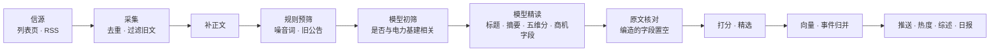

# 系统问答：电力基建情报站是怎么工作的

这份文档用问答的形式，讲清楚系统要解决什么问题、一条信息从进来到出现在页面上经过了哪些步骤、每一步为什么这样设计，以及接下来要改什么。
代码细节见 [ARCHITECTURE.md](ARCHITECTURE.md)，运维操作见 [RUNBOOK.md](RUNBOOK.md)，信源见 [SOURCES.md](SOURCES.md)。

---

## 一、定位

### 这个系统是做什么的？

每天自动从电网公司、政府、招标平台和行业媒体收集信息，用大模型判断哪些对我们的业务有用，挑出**精选**，把招标、中标、项目信息整理成**商机**，并在早上出一份**日报**。

业务画像（在「设置 → 画像与打分」里可改）：

- 业务线 1：智能运检 / AI 视觉（无人机巡检、布控球、视频监控、在线监测、安监识别）
- 业务线 2：输变电工程施工 / EPC（110kV 及以上变电站、输电线路、配网改造）
- 范围：全国；最关心国网/南网及省公司、发电集团的招标与中标，项目的核准、可研、开工，以及电网投资规划和数字化政策。

### 「精选」和「商机」有什么区别？

- **精选**回答「今天哪些信息值得我看」：政策、规划、技术动态、招标都可能入选，由五维评分和门槛决定。
- **商机**回答「哪些项目我可以去跟」：招标、中标、项目、规划四类频道会额外抽取结构化字段（项目名、业主、金额、电压等级、截止时间、中标人等），进入商机看板，可以标记跟进状态、设提醒。一条商机不一定进精选，但匹配度高时同样会推送。

### 和 AIHOT 有什么关系？

AIHOT（aihot.news）是一个开源的 AI 行业热点站，思路和我们相近：采集 → 模型筛选 → 聚合同一事件 → 热度 → 日报。我们借鉴了它的做法（见第九节），但我们的核心是**商机**，这是它没有的：招标字段抽取、原文核对、截止提醒、跟进看板。所以我们没有照搬它的代码，而是按需吸收它的设计。

---

## 二、整体流程

### 一条信息从进来到出现在页面上，经过哪些步骤？



1. **采集**：按每个信源的间隔抓列表页，新链接入库，同一链接只留一份。
2. **补正文**：列表页只有标题的，按配置到详情页抓正文。
3. **规则预筛**（不花钱）：命中「食堂、物业、保洁」等非电力采购，或标题年份早于去年的旧公告，直接淘汰。
4. **模型初筛**（便宜）：15 条一批，只判断「与电力基建相关吗」，拿不准就放行。招标平台类信源天然相关，跳过这一步。
5. **模型精读**（逐条）：写中文短标题、摘要、推荐理由、建议动作，打五个维度的分，招标/中标/项目/规划类再抽商机字段。
6. **原文核对**：商机字段必须能在原文里找到，找不到就置空。
7. **打分与精选**：代码按权重合成总分，过门槛进精选。
8. **事件归并**：同一个项目、同一件事的多篇报道归成一个事件，信息流里只显示主稿。
9. **后续**：订阅推送、热度重算、事件综述、日报周报、截止提醒。

### 这些步骤由谁来执行？

| 进程 | 做什么 |
|---|---|
| **worker** | 所有后台工作：定时调度、采集、调模型、归并、日报、推送、备份。只允许一个实例运行（数据库锁保证） |
| **api** | 给网页提供数据，以只读为主；「立即采集」「生成日报」「开始评测」这类操作只往队列里放任务，交给 worker 执行 |
| **web** | 网页（服务端渲染），只通过 api 取数据 |
| **db** | PostgreSQL，带向量扩展，保存全部数据和任务队列 |
| **caddy** | 对外入口：`/api` 转给 api，其余转给 web |

**读者打开页面时不会调用模型**：模型只在 worker 的任务里调用，页面读的都是已经算好的结果，所以页面快，也不会因为有人刷新而多花钱。

---

## 三、采集

### 信源从哪来，怎么加新的？

信源定义在 `server/app/seed/sources.yaml`，部署时同步进数据库。大多数政府、电网、招标站点是「列表页 + 文章链接」结构，只需加一段配置（列表页地址、链接正则、正文选择器），不用写代码。需要调接口或渲染 JS 的站点（例如国网电商平台）要写专门的采集器。步骤见 [SOURCES.md](SOURCES.md)。

### 信源分几档？有什么用？

| 档位 | 含义 | 例子 |
|---|---|---|
| T1 一手 | 政府、电网公司、招标平台 | 国家能源局、南方电网、政府采购网 |
| T1_5 行业 | 专业媒体 | 北极星 |
| T2 媒体 | 综合媒体、自媒体 | 公众号桥 |

档位影响两件事：精选门槛（一手的门槛低一些），以及同一事件里谁当主稿（一手优先）。目前档位还额外乘了系数、并写进了模型输入，重复计算了，第 2 步会修正（见第九节）。

### 多久抓一次？站点挂了怎么办？

每个信源有自己的间隔（在设置页可改）。worker 每分钟检查一次到期的信源。连续失败的信源自动退避，间隔翻倍，最多 8 倍，避免反复访问挂掉的站点。每次抓取都记录 HTTP 状态、抓到多少条、新增多少条，在「设置 → 信源与流水线」能看到。

### 怎么去重、怎么挡住旧文？

- 同一个链接只入库一次，重复抓到只刷新「最后看到时间」。
- 发布时间超过 30 天的不入库。
- 标题里的年份全都早于去年的（比如「2023年12月第2批采购」），预筛直接淘汰。列表页常把历史公告置顶，这一步不花钱就能挡掉。
- 已过投标截止时间的商机仍留在商机看板，但不占精选名额。

---

## 四、判断：筛选、精读、打分

### 为什么分成规则预筛、模型初筛、模型精读三层？

为了省钱，也为了让每一层只做一件事：

- **规则预筛**：零成本拦截特征明确的噪音。
- **模型初筛**：一次看 15 条标题和开头，只回答「相关 / 不相关」，便宜，宽进。误杀的信息就永远消失了，误放的还有精读把关，所以拿不准就放行。
- **模型精读**：只对通过的条目逐条做，成本最高、输出最多。

实测 226 条精读约 ¥1.2，精选率约 22%。

### 精读输出什么？

中文短标题、60–120 字摘要、推荐理由、建议动作、频道（9 类）、省份、标签、事件标识、是否「包装大于实质」、五维分；商机类再加项目名、业主、金额（万元）、电压等级、阶段、招标编号、截止时间、资质要求、中标人、业务线和匹配度。

### 五维分是什么？总分怎么算？

模型按区间锚定给每个维度打 0–10 分：

| 维度 | 看什么 | 默认权重 |
|---|---|---|
| 电力基建相关度 | 直接关于输变电/配网/变电站建设或运检，还是泛能源 | 0.30 |
| 商机价值 | 与业务线对口的在招项目，还是间接线索 | 0.30 |
| 确定性 | 正式公告、批复文件，还是传闻 | 0.15 |
| 时效 | 近 3 天且有截止窗口，还是旧闻 | 0.10 |
| 影响面 | 国家级/百亿级，还是个别单位 | 0.15 |

总分由代码计算，不让模型直接给总分：

```
总分 = 加权平均 × 10 × 档位系数（T1 1.2 / T1_5 1.1 / T2 1.0）
       「包装大于实质」再 × 0.7
```

达到所在档位的门槛（T1 60 / T1_5 65 / T2 70）就进精选。权重、系数、门槛、业务画像都存在数据库里，设置页改完，之后处理的条目立即生效。

### 模型会不会编造金额、业主这些字段？

会，所以用代码核对：项目名、业主、编号、中标人、金额、电压、截止时间必须能在原文里找到（金额允许元、万元、亿元之间换算）。找不到就置空，并记下被丢弃的字段，详情页会显示「无法在原文核实」。

### 模型服务出故障怎么办？

**不静默降级**：模型调用失败的条目标记为「失败」，绝不用关键词规则分冒充模型分。旧系统曾因模型下线，悄悄退化成关键词打分长达 19 小时。

- 超时、限流、服务端错误：自动重试，每 15 分钟再排一次，最多 3 次。
- Key 失效、余额不足、模型名下线：直接挂起不重试，修好配置后在设置页一键重试。

用的是 DeepSeek：`deepseek-flash` 关闭推理，做初筛和精读，约 3 秒一条；`deepseek-v4-pro` 低强度推理，写日报导语和事件综述。

---

## 五、事件与热度

### 同一个项目有好几篇报道，怎么合并？

先用确定的线索，再用模糊的：

1. 招标编号相同 → 同一事件
2. 规范化后的项目名相同 → 同一事件
3. 模型给的事件标识相同 → 同一事件
4. 标题摘要的向量相似度 ≥ 0.86（最近 7 天）→ 同一事件
5. 标题二字组重合度 ≥ 0.6（最近 3 天）→ 同一事件

合并在全局锁下逐条进行，避免同时处理两篇报道时各建一个事件。每个事件选一篇**主稿**：先比档位（一手优先），再比分数。信息流只显示主稿，并提示「另有 N 家信源报道」。

### 热度怎么算？和精选分有什么区别？

两套体系，互不干扰：

- **精选分**衡量「这条值不值得看」。
- **热度**衡量「有多少家在说」：每个独立来源只算一次（取它最近一次报道），按 24 小时半衰期衰减后相加，再乘 10，窗口 72 小时。同一家媒体发十篇也只算一家，所以热点榜上靠前的是真正被多家报道的事。

### 事件综述是什么？

报道数 ≥ 2 的事件，每 30 分钟检查一次，有新报道就让模型重写一段综述：先写最新进展，再按规划 → 核准 → 招标 → 中标 → 开工的顺序讲来龙去脉，最后一句写「尚未披露：……」，列出对跟进有用但报道里还没有的信息（金额、标段、截止时间等）。

---

## 六、产出：页面、推送、日报

### 网站上有哪些页面？

| 页面 | 内容 |
|---|---|
| 精选（首页） | 按发现时间排序的精选主稿，可按频道筛选 |
| 商机 | 招标/中标/项目/规划看板：按金额、截止时间、电压、省份、业务线筛选；可标记关注、跟进、忽略，写跟进备注 |
| 热点 | 按热度排的事件，点进去是事件时间线和综述 |
| 日报 | 日报、周报归档 |
| 全部 | 所有精读过的条目，也能看被淘汰的及原因 |
| 收藏 | 收藏和笔记 |
| 搜索 | 关键词召回和语义召回合并，再用重排模型排序 |
| 设置 | 信源与流水线、订阅推送、画像与打分、精选校准、模型用量、任务队列 |

### 什么时候会推送到飞书？

新条目成为事件主稿时检查：进了精选，或商机匹配度 ≥ 60，并且命中某条订阅规则（关键词、省份、频道、最低金额、最低电压）才推送。同一条目、同一规则只推一次，由数据库唯一约束保证。

另外每天 09:05 和 16:05 做截止提醒：3 天内截止、且你标了关注/跟进（或匹配度 ≥ 60 还没处理）的商机。

### 日报怎么生成？

每天 08:00 出日报（覆盖前一天 08:00 到当天 08:00），周一 08:30 出周报。**版块归类和选材由代码完成**：商机速递、政策规划、电网与市场、技术与行业，每个版块日报最多 8 条、周报 12 条。模型只写头条、导语和版块点评，而且只能引用给定的条目编号，不会编出列表里没有的事。

---

## 七、精选校准（标注）

### 为什么要标注？

标注是给系统做一把「标准答案尺子」。

现在的权重、门槛、提示词都是凭感觉定的。改了一处以后，精选是变好了还是变差了，没有东西能回答。有了你亲手标的「该选 / 不该选」，就能量出两个数：

- **查准率**：精选里真该看的占多少。低了说明噪声多，浪费你的时间。
- **查全率**：该看的有多少被选上了。低了说明在漏商机。

更重要的是能看到**错在哪一类**：是某个信源、某个频道，还是「差一点入选」的那一档总判错。改完提示词或参数，在同一批样本上重跑，数字会直接告诉你改得对不对。

你的标注和备注本身就是业务 KnowHow。第 2 步改评分标准时，「什么算重要、什么算噪声」的例子就从你的备注里来。

### 怎么标？标多少？

「设置 → 精选校准」，快捷键 1 该选 / 2 不该选 / 3 两可 / S 跳过。建议标 150 条左右。

- 页面只给原文，不显示 AI 的分数和摘要，免得被系统的判断带偏。
- 抽样偏向难例：当时入选的约 30%，差一点入选的约 30%，低分的约 15%，被淘汰的约 25%。一眼就能判断的条目放太多，准确率会虚高。
- 约 1/5 自动进留出集。调提示词时只看开发集，定稿前再用留出集检查一遍，免得把提示词调成只会做这几道题。

### 评测怎么用？

| 方式 | 花费 | 用途 |
|---|---|---|
| 线上已有判断 | 免费 | 直接用库里的结果，作为基线 |
| 用当前提示词重跑 | 约每条 ¥0.005–0.01 | 改了提示词或参数后，在同一批样本上对比。不写回条目 |

每次评测都会存档，包括当时的配置、总体指标、按抽样层/档位/频道的判错分布、门槛从 40 到 90 的扫描，以及每条判错的条目。

**先改标准，再动门槛**：门槛只能整体上下移动，解决不了「哪一类判错了」。只有判错的条目分数都贴着门槛时，才去调门槛。

---

## 八、运行与部署

### 定时任务有哪些？

| 任务 | 时间（北京时间） |
|---|---|
| 调度采集（按各信源间隔，失败退避） | 每分钟检查 |
| 重试失败或滞留的条目 | 每 15 分钟 |
| 热度重算、事件综述 | 每 30 分钟 |
| 队列维护（恢复卡住的任务、清理旧任务；被淘汰超过 60 天的条目清掉正文，有标注的除外） | 每 10 分钟 |
| 日报 / 周报 | 每天 08:00 / 周一 08:30 |
| 截止提醒 | 09:05、16:05 |
| 数据库备份 | 03:30，保留 14 天 |

### 任务队列为什么放在数据库里？

不用另装 Redis。任务写在 `jobs` 表里，worker 认领时加行锁，多个消费者互不冲突。执行中持续发心跳，进程崩溃后超时的任务会被重新排队，不会丢。同一个任务（例如同一信源的采集）在排队或执行时不会重复入队。

### 花多少钱？

主要是模型调用：精读约 ¥0.005 一条，一天几百条约一两块钱。向量和重排用硅基流动的 bge-m3 与 bge-reranker。每次调用的 token 数、估算费用、耗时和错误都记在 `llm_calls` 表，「设置 → 模型用量」按天、按任务汇总，评测的花费单独列为「评测·」。

### 怎么部署和更新？

Docker Compose 一键部署（db、api、worker、web、caddy）。

- 本机：跑在 WSL 的 Ubuntu 里，地址 http://127.0.0.1:18090。
- 更新：代码推到 GitHub 的 `v2` 分支，在 WSL 里拉代码并执行 `deploy/deploy.sh`，数据库迁移会自动执行。
- 生产：计划迁到阿里云服务器，尚未完成。

密钥（DeepSeek、硅基流动）只放在部署目录的 `.env` 里，不进 Git。

---

## 九、接下来要改什么

对照 AIHOT 的做法，现有设计有几处问题，按顺序改。每一步都用第七节的评测验证。

### 第 1 步：精选校准（已完成）

标注页和评测工具。标完约 150 条以后，先跑一次「线上已有判断」拿到基线。

### 第 2 步：改评分（收益最大）

现在的问题：

- **信源档位被计算了三次**：模型输入里写了档位，总分又乘档位系数，门槛还按档位分。结果是一手信源原始分 50 就能入选，媒体要 70；而 9 个信源里有 6 个是一手。
- **一次调用什么都做**：模型先写推荐理由再打分，分数容易被自己刚写的理由带着走。
- **「相关度」和初筛重复**：能进精读的基本都相关，这一项普遍偏高，把总分整体抬高了。
- **「时效」让模型算日期**：发布时间和截止时间都有，应该由代码算。
- **全局只有一套权重**：招标、政策、技术动态看重的维度本来就不一样。

改法：

- 精读拆成两次调用：第一次只打分，不告诉模型档位，按频道用不同的权重，加上电力领域的噪声封顶规则（例如党建/人事/慰问稿、框架协议汇总、已截止公告的分数上限）；第二次写标题、摘要、理由、建议动作并抽商机字段。
- 时效由代码计算；去掉档位系数，档位只通过门槛起作用。
- 用评测判断要不要像 AIHOT 那样独立打两次分取平均。

### 第 3 步：改事件归并

- 模型编的英文事件标识不稳定：同一件事两次可能编出不同的标识，不同项目也可能撞上同一个。改成「主体 / 动作 / 对象 / 日期」的事实结构。
- 相似度在 0.6–0.86 之间、拿不准的候选，交给模型判断关系：同一次发生 / 同一项目的后续进展（招标 → 中标候选人 → 中标结果）/ 无关 / 汇总稿。
- 汇总稿（例如「X 月第 N 批集中招标」）不参与合并，避免把不相干的项目吸到一起。
- 保留招标编号、项目名这两道硬规则，它们比 AIHOT 的做法更适合招标类信息。

### 第 4 步：小项

- 提示词拆出公共规则（防注入、防编造、摘要第一句先给答案、标题要点出主体、相对时间不换算成年份），按内容哈希记版本，每条判断都能查到是哪一版提示词做的。
- 新信源第一次抓到的存量只归档，不推送、不进「今天」。
- 采集频率按信源的产出自动调整。

### 其他待办

- 接入国网电子商务平台（最有价值的一手招标源，需要写专门的采集器）。
- 部署到阿里云服务器。
- 是否把 `v2` 合并到 `main`。
