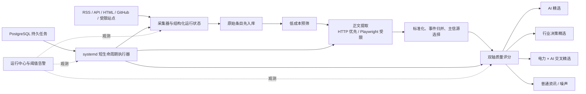

# PowerAI Hot 项目完成与生产替换设计

日期：2026-07-28  
状态：已确认  
生产主机：`124.220.207.16`

## 1. 目标

把当前 PowerAI Hot 从“功能较全但存在生产入口、内容覆盖和工程可靠性缺口”的状态，收敛为可持续运行的正式版本：

1. 新版接管 `124.220.207.16` 的 HTTPS 入口，旧“博诺思”Web 入口退出。
2. 产品定位固定为“电力行业资讯 + AI 资讯 + 电力×AI 交叉情报”。
3. 纯行业内容只将具有决策价值的政策、技术路线、关键项目、采购机会和市场变化纳入精选。
4. 补齐正文、历史数据、交叉精选和受限站点采集链路。
5. 把易丢失的进程内后台任务改造成可恢复、可审计的持久任务。
6. 建立正式数据库迁移、容量门禁、可观测性和跨平台测试。
7. 清理前端警告、文档漂移和已下线功能遗留。

## 2. 不在范围内

- 不恢复需求池、行业知识库或关系图谱。
- 不引入常驻 Redis、Celery、Kafka 或 Prometheus 集群。
- 不将普通会议、日常通知和低价值转载纳入行业精选。
- 不以大规模视觉重写替代生产可靠性修复。
- 不删除生产数据库、持久卷或未核验的历史备份。

## 3. 已确认的产品原则

### 3.1 三条独立内容轴

- **AI 精选**：模型、产品、产业、政策和开源生态中真正重要的变化。
- **行业精选**：电力行业中具有决策价值的政策、技术路线、关键项目、采购和市场变化。
- **交叉精选**：同时影响 AI 与电力业务的内容，例如算力负荷、电网智能化、行业模型和相关招采。

三类精选独立打分和路由，不能用一套阈值互相挤占。普通资讯仍可进入“全部资讯”，但不自动获得精选标记。

### 3.2 阅读优先

首页首先回答：

1. 今天最重要的变化是什么；
2. 为什么值得关注；
3. 它与电力业务或 AI 技术有什么关系。

文章卡片保留决策分数、摘要、推荐理由、标签、时间、主信源和同事件信源数。采集、任务、模型与主机信息进入独立管理域。

### 3.3 来源与正文优先

原始内容先入库，再执行预筛、正文提取、事件归并和质量评分。正文获取优先使用普通 HTTP；只有已批准且确有必要的站点才允许进入受限 Playwright 通道。

## 4. 参考项目的取舍

参考项目只用于吸收成熟模式，不进行代码照搬：

- [ai-news-aggregator](https://github.com/SuYxh/ai-news-aggregator)：多源聚合、关键词过滤、历史与收藏能力。
- [ai-hot-radar](https://github.com/zenitlab/ai-hot-radar)：两阶段 AI 评分、事件去重、主信源选择和个性化关注。
- [github-trending-spider](https://github.com/wenbochang888/github-trending-spider)：多源独立失败、中文摘要、结构化归档和可选增强产物。
- [AI HOT](https://aihot.virxact.com/)：阅读优先的分数、摘要、标签、推荐理由与同事件信源表达。

PowerAI Hot 保留自身已有 FastAPI、React、PostgreSQL、systemd timers 和轻量单机部署架构。

## 5. 目标架构

## 6. 内容供给设计

### 6.1 采集运行状态

每个信源运行必须记录：

- 开始、结束和耗时；
- 发现、解析、写入、跳过和失败数量；
- 最新内容时间；
- 失败分类和截断后的错误信息；
- 正文覆盖率与精选产出；
- 采集器版本或配置摘要。

信源失败互相隔离，单个来源不得中止整批采集。

### 6.2 正文提取

正文提取分两级：

1. 普通请求、可读性解析和来源专用选择器；
2. 受限 Playwright 浏览器通道。

Playwright 约束：

- 仅用于明确列入允许清单的来源，第一目标为北极星电力网；
- 单实例、串行执行；
- 设置页面、批次和总运行超时；
- 禁止下载、视频、字体等无关资源；
- 完成后必须退出；
- 记录每个 URL 的结果和资源消耗；
- 失败后退回标题和摘要，不阻塞其他来源。

### 6.3 历史回填

提供可恢复的正文回填任务：

- 按来源、日期和正文缺失状态分批扫描；
- 幂等更新，不重复创建文章；
- 保存游标和批次状态；
- 回填后重新执行标准化、评分和事件归并；
- 可限制每次处理量和时间预算；
- 119 条已支持域名历史文章先回填，再处理北极星历史数据。

### 6.4 精选判定

AI 与行业使用独立维度，但共享以下基础证据：

- 来源可信度；
- 正文完整度；
- 新颖性和时效性；
- 是否为一手来源；
- 多源交叉验证；
- 事件影响范围。

行业决策价值额外关注政策约束、技术路线变化、项目规模、采购可操作性和市场结构变化。交叉精选必须同时达到 AI 相关性、电力相关性和最低决策价值，不因单轴高分误入。

对审计中 148 条“双轴皆低但仍进入付费模型”的弱轴候选，增加规则型预筛和轻量模型门槛。用固定边界样本回放，目标是在金标召回率不低于 95% 的前提下，将该类付费模型调用量降低至少 50%。

CCGP 先对当前 48 条和随后 30 天增量做完整复核：

- 若决策价值命中率为 0，停止进入精选候选，仅保留原始监控；
- 若命中率低于 5%，改为低频“采购观察”栏目，不进入默认精选；
- 若命中率达到或超过 5%，保留为采购信源，并为命中规则建立回归样本。

### 6.5 事件归并

相同事件保留一个主条目并关联其他来源：

- 官方或一手来源优先；
- 正文完整、发布时间明确者优先；
- 转载不覆盖原始来源；
- API 返回同事件来源数量和可展开的来源列表。

## 7. 持久任务设计

### 7.1 为什么替换进程内后台任务

FastAPI `BackgroundTasks` 和手工线程在容器重启、发布或进程崩溃时可能丢失。采集、历史回填、研报和卡片生成需要持久状态。

### 7.2 数据模型

任务表至少包含：

- `id`、`job_type`、`status`；
- `payload_json` 和 `idempotency_key`；
- `priority`；
- `attempt_count`、`max_attempts`；
- `available_at`、`started_at`、`finished_at`；
- `heartbeat_at`；
- `result_json`、`error_type`、`error_message`；
- `created_by`、`created_at`、`updated_at`。

首批正式 `job_type`：

- `manual_crawl`
- `scheduled_crawl`
- `article_fulltext_backfill`
- `article_reenrich`
- `weekly_report_generate`
- `topic_report_generate`
- `card_generate`
- `card_retry`
- `favorite_card_generate`

旧 API 保持原有业务字段，同时增加 `job_id`、`status_url` 和可区分的 `202` 状态；前端用状态接口轮询，不再假设请求返回即执行完成。

### 7.3 领取与执行

- API 校验请求并写入任务，返回 `202` 和任务 ID。
- PostgreSQL 使用 `FOR UPDATE SKIP LOCKED` 原子领取。
- systemd 每分钟启动一次短生命周期执行器，处理限定数量后退出。
- SQLite 本地环境使用单执行器和事务比较更新。
- 临时网络、限流和模型服务错误采用指数退避。
- 参数、权限和不可解析数据错误直接失败。
- watchdog 回收心跳超时的运行中任务。
- 幂等键避免人工重复点击或定时器重叠造成重复执行。

每种任务都必须执行重启验收矩阵：入队后重启 API、执行中重启执行器、临时错误重试、重复请求幂等、最大重试后失败、过期心跳回收。收藏触发卡片还要验证取消收藏后不会产生孤立可见卡片。

## 8. 数据库迁移

- 为当前生产 PostgreSQL 结构建立经核对的 Alembic baseline。
- 新任务表、索引和字段全部通过正式迁移创建。
- 发布前备份并执行 `alembic upgrade head`。
- SQLite 与 PostgreSQL 都执行迁移测试。
- 保留旧迁移辅助代码一个兼容周期，但停止新增运行时 `ALTER TABLE`。
- 删除兼容层前必须确认所有生产和开发数据库已进入 Alembic 管理。

## 9. 前端信息架构

### 9.1 主导航

阅读域：

- 今日情报；
- 专题追踪；
- 我的收藏；
- 研报与订阅。

管理域：

- 运行中心；
- 信源管理；
- 系统设置。

已下线的需求池、行业知识库和关系图谱不再出现于导航、路由入口或前端文案。

### 9.2 首页

第一屏顺序：

1. 搜索和今日更新状态；
2. 三条以内的“电力 × AI 交叉精选”；
3. 综合、行业、AI、交叉和全部资讯标签；
4. 按决策价值排序的单列阅读流。

### 9.3 组件边界

至少抽取：

- `ArticleCard`
- `ScoreBadge`
- `SourceTrust`
- `FilterBar`
- `EmptyState`
- `RunStatus`

统一颜色、字体、字号、间距、圆角、边框和状态设计令牌，清除重复行内样式。桌面保留侧栏；移动端为单列信息流、底部导航和筛选抽屉。

## 10. 生产入口与发布

### 10.1 HTTPS 接管

用户已确认方案 A：

- `https://124.220.207.16` 改为代理新版 PowerAI Hot；
- 旧“博诺思”Web 路由停止并退出该入口；
- 如旧服务仍需保留，仅允许保留后端数据或迁移到未公开的独立入口，不得继续占用正式 HTTPS；
- 更新 TLS 配置后验证浏览器不再进入旧登录页。

当前 IP 证书为短周期证书，现有续期单元和部署钩子仍带 Hermes 命名。切换时必须：

- 保留有效证书文件和续期账户，不因停旧 Web 删除证书数据；
- 将续期 timer/service 和部署 hook 改为 PowerAI Hot 中性命名；
- 部署 hook 在证书更新后执行 Caddy 配置校验与无损 reload；
- 续期失败、证书剩余不足 72 小时或 reload 失败时发送飞书告警；
- 上线当天执行一次 dry-run 或 staging 续期验证，并验证 hook；
- 每日记录证书到期时间，正式证书剩余有效期必须始终高于 72 小时。

### 10.2 容量门禁

当前磁盘使用率约 85%，发布前先进行安全回收：

- 清理可重建的 Docker build cache；
- 只删除已经核验、不被当前或回滚版本使用的旧镜像；
- 保留当前版本和最近两个可回滚版本；
- 数据库备份保留 7 天；
- 不删除数据库卷；
- 构建前要求根分区可用空间不少于 10 GiB 且使用率不高于 78%，任一不满足即停止；
- 发布完成后要求可用空间不少于 8 GiB 且使用率不高于 82%；
- 清理前、构建前和发布后都记录 `df`、Docker image 和 build cache 摘要。

### 10.3 发布顺序

1. 检查磁盘、备份和当前容器；
2. 构建并运行测试；
3. 执行数据库备份与迁移；
4. 启动新版本并完成内部 smoke test；
5. 切换 HTTPS；
6. 完成外部浏览器验收；
7. 保留上一版本作为即时回滚目标；
8. 清理超出保留策略且已核验的旧构建产物。

## 11. 可观测性与告警

现有管理端作为唯一运维视图：

- 信源成功率、最新内容时间、正文覆盖率、噪声率、三类精选产出；
- 主模型、备用模型和规则兜底比例；
- 模型延迟、错误分类、重试和估算调用量；
- 任务排队、运行、重试、失败、最老等待时间和过期心跳；
- 磁盘水位、容器健康、备份新鲜度和当前发布版本。

飞书只在阈值跨越和恢复时告警，避免周期性重复轰炸。每条告警必须能追溯到运行记录。

## 12. 测试与质量门禁

### 12.1 后端

- Windows 运行普通后端测试；
- POSIX 文件锁和部署脚本测试在 Linux CI 或 Linux 容器运行；
- PostgreSQL 集成测试覆盖任务领取、并发、重试和迁移；
- 正文提取用固定 HTML fixture，Playwright 仅做少量受控集成测试；
- 历史回填覆盖中断恢复和重复运行；
- 精选路由使用金标样本和边界样本。

### 12.2 前端

- 当前测试保持通过；
- TypeScript 类型检查通过；
- ESLint warning 清零；
- 首页、筛选、详情、收藏和运行中心覆盖组件测试；
- 桌面和移动端执行浏览器 smoke test。

### 12.3 文档与配置

- README 的来源数量、功能和测试数字必须来自可验证脚本或删除易漂移的硬编码；
- 示例配置与实际设置对象通过契约测试绑定；
- 发布说明包含迁移、回滚、备份、磁盘门禁和 HTTPS 验证。

## 13. 错误处理

- 外部来源错误按超时、限流、认证、解析和内容为空分类。
- 模型错误按临时、配额、配置和内容安全分类。
- 任务错误保留可安全展示的摘要，敏感凭据不得入库或进入告警。
- 单来源失败不影响整批；数据库或迁移失败必须阻止发布。
- HTTPS 切换失败立即回滚代理配置，不回滚已经成功且兼容的数据库迁移。

## 14. 分阶段交付

### 第一批：生产止血

- HTTPS 接管；
- 磁盘安全回收和发布空间门禁；
- POSIX 测试进入 Linux 执行；
- 前端警告清零；
- README 和运行文档对齐。

### 第二批：内容补齐

- 先交付最小 Alembic baseline、任务表和单执行器，满足回填中断恢复；
- 历史正文回填；
- 北极星受限 Playwright 采集；
- 双轴精选和交叉精选校准；
- 弱轴预筛成本治理；
- CCGP 信源价值复核并按命中率执行停用、降级或保留；
- 事件归并和主信源逻辑完善。

### 第三批：工程底座

- 将人工采集、定时采集、研报、卡片和收藏触发任务全部迁移到持久任务；
- 完成 Alembic 兼容层收尾；
- 运行中心和告警；
- 配置契约和发布门禁。

### 第四批：生产验证

- 全量测试和构建；
- 内外部 smoke test；
- 内容覆盖和精选质量抽样；
- 重启、重试、回滚和备份恢复演练；
- 交付正式网站地址和运维手册。

## 15. 验收标准

### 15.1 入口

- `https://124.220.207.16` 打开新版 PowerAI Hot；
- 不再出现“博诺思”登录页；
- 健康检查、静态资源和 API 均通过 HTTPS；
- HTTP 行为与安全策略明确且不把用户导向旧服务。

### 15.2 稳定性

- 后端普通测试、Linux POSIX 测试、前端测试、类型检查和 lint 全部通过；
- 发布后容器健康，定时器正常；
- 手工任务在 API/容器重启后不丢失；
- 数据库迁移可重复检查且存在已验证备份；
- 构建前可用空间不少于 10 GiB、使用率不高于 78%；
- 发布后可用空间不少于 8 GiB、使用率不高于 82%；
- 证书续期 dry-run 或 staging 验证、部署 hook 和 Caddy reload 均成功；
- 证书剩余不足 72 小时会触发告警。

### 15.3 内容

- 已支持域名的历史缺失正文完成回填或产生可解释失败记录；
- 北极星新内容由受限通道获取正文，失败不阻塞其他来源；
- 建立至少 160 条固定金标与边界样本：AI、行业、交叉和低价值边界各不少于 40 条；
- AI 精选和行业精选的金标精确率均不低于 90%，低价值行业内容误入率不高于 10%；
- 交叉精选样本中同时满足 AI 相关性、电力相关性和决策价值的比例不低于 90%，正样本召回率不低于 85%；
- 弱轴预筛保持至少 95% 金标召回率，并将该类付费模型调用量降低至少 50%；
- 事件归并在固定样本上的 pairwise F1 不低于 0.90，主信源选择正确率不低于 95%；
- 三类路由分别通过包含正负样本的测试，不能以空输出视为通过；
- CCGP 按 0%、低于 5%、不低于 5% 的决策价值命中率规则产生明确处置记录。

### 15.4 前端

- 阅读域与管理域分离；
- 首页交叉精选、分类标签和文章卡片信息完整；
- 移动端无关键内容溢出；
- 已下线功能无可见入口；
- 无 ESLint warning 和浏览器关键控制台错误。

## 16. 回滚原则

- 代理切换、应用版本和迁移分开处理。
- 入口异常优先回滚代理到上一版 PowerAI Hot，而不是恢复旧“博诺思”正式入口。
- 应用异常回滚到上一容器版本。
- 仅在迁移不向后兼容时执行专门的数据回退方案；默认使用向前修复。
- 所有回滚动作记录时间、版本、执行人、原因和验证结果。
